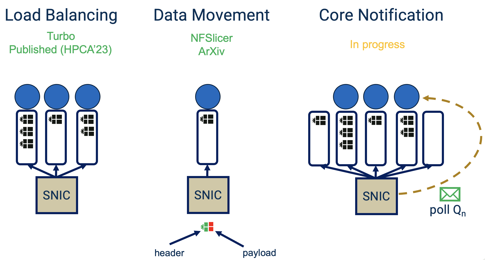
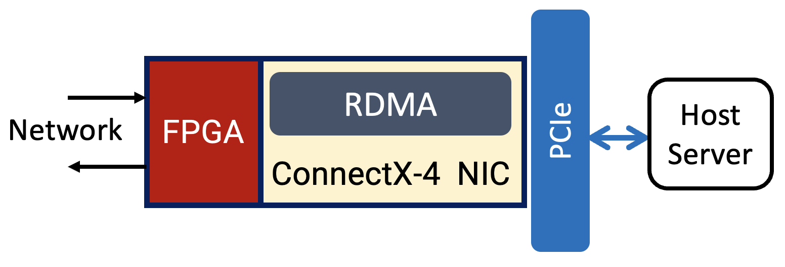

Welcome! If you're here to know more about me, you're at the right place! I'll make this easy :D
- Final-year PhD student
  - School: Georgia Institute of Technology
  - Major: Electrical and Computer Engineering (ECE) 
  - Advisor: Alexandros Daglis
  - Research interests: datacenters, smartNICs, in-network computing, RDMA/RoCE, computer architecture, FPGAs
  - I'm currently seeking full-time opportunities to research and develop forms of in-network computing to accelerate latency-critical datacenter workloads. If my profile piques your interest, please reach out via email: hamed@gatech.edu

- Topic: Optimizing the Datacenter Network with SmartNICs to Accelerate Latency-Critical Online Services
  - Datacenters traditionally operate with a strict boundary between network and compute. The increasing demands of today’s datacenters has instigated a push toward merging the two, giving rise to the advent of smartNICs. While tightly coupled with their hosts, smartNICs can inspect packets, extract hints, and leverage them to enabling unique network-compute performance optimizations, which boost server throughput under very tight tail latency SLOs for latency-critical microservices. My work identifies prime use cases for boosting datacenter performsance using smartNICs and clarifies why smartNICs should co-exist, alongside server grade CPUs, as first-class citizens within the datacenter.

<!---
* In short, I enjoy building high performance systems (hardware and software)
-->

My work in one slide!
------

I have hands-on experience with the following SmartNICs:

| Mellanox Innova Flex-4 SmartNIC  | Mellanox BlueField-2 DPU |    
|:--------------------------------:|:------------------------:|
| 40G FPGA SmartNIC | 100G SoC SmartNIC |
|  |  |
|  |  |

<!---
|  |  |
|  |  |

- Mellanox Innova Flex-4 SmartNIC
  - 40G FPGA SmartNIC

  
  

- Mellanox BlueField-2 DPU
  - 100G SoC SmartNIC

  
  

-->

If you're interested in collaborating or have any questions, please don't hesitate to reach out!

<!---
Getting started
======
1. Register a GitHub account if you don't have one and confirm your e-mail (required!)
1. Fork [this repository](https://github.com/academicpages/academicpages.github.io) by clicking the "fork" button in the top right. 
1. Go to the repository's settings (rightmost item in the tabs that start with "Code", should be below "Unwatch"). Rename the repository "[your GitHub username].github.io", which will also be your website's URL.
1. Set site-wide configuration and create content & metadata (see below -- also see [this set of diffs](http://archive.is/3TPas) showing what files were changed to set up [an example site](https://getorg-testacct.github.io) for a user with the username "getorg-testacct")
1. Upload any files (like PDFs, .zip files, etc.) to the files/ directory. They will appear at https://[your GitHub username].github.io/files/example.pdf.  
1. Check status by going to the repository settings, in the "GitHub pages" section

Site-wide configuration
------
The main configuration file for the site is in the base directory in [_config.yml](https://github.com/academicpages/academicpages.github.io/blob/master/_config.yml), which defines the content in the sidebars and other site-wide features. You will need to replace the default variables with ones about yourself and your site's github repository. The configuration file for the top menu is in [_data/navigation.yml](https://github.com/academicpages/academicpages.github.io/blob/master/_data/navigation.yml). For example, if you don't have a portfolio or blog posts, you can remove those items from that navigation.yml file to remove them from the header. 

Create content & metadata
------
For site content, there is one markdown file for each type of content, which are stored in directories like _publications, _talks, _posts, _teaching, or _pages. For example, each talk is a markdown file in the [_talks directory](https://github.com/academicpages/academicpages.github.io/tree/master/_talks). At the top of each markdown file is structured data in YAML about the talk, which the theme will parse to do lots of cool stuff. The same structured data about a talk is used to generate the list of talks on the [Talks page](https://academicpages.github.io/talks), each [individual page](https://academicpages.github.io/talks/2012-03-01-talk-1) for specific talks, the talks section for the [CV page](https://academicpages.github.io/cv), and the [map of places you've given a talk](https://academicpages.github.io/talkmap.html) (if you run this [python file](https://github.com/academicpages/academicpages.github.io/blob/master/talkmap.py) or [Jupyter notebook](https://github.com/academicpages/academicpages.github.io/blob/master/talkmap.ipynb), which creates the HTML for the map based on the contents of the _talks directory).

**Markdown generator**

I have also created [a set of Jupyter notebooks](https://github.com/academicpages/academicpages.github.io/tree/master/markdown_generator
) that converts a CSV containing structured data about talks or presentations into individual markdown files that will be properly formatted for the academicpages template. The sample CSVs in that directory are the ones I used to create my own personal website at stuartgeiger.com. My usual workflow is that I keep a spreadsheet of my publications and talks, then run the code in these notebooks to generate the markdown files, then commit and push them to the GitHub repository.

How to edit your site's GitHub repository
------
Many people use a git client to create files on their local computer and then push them to GitHub's servers. If you are not familiar with git, you can directly edit these configuration and markdown files directly in the github.com interface. Navigate to a file (like [this one](https://github.com/academicpages/academicpages.github.io/blob/master/_talks/2012-03-01-talk-1.md) and click the pencil icon in the top right of the content preview (to the right of the "Raw | Blame | History" buttons). You can delete a file by clicking the trashcan icon to the right of the pencil icon. You can also create new files or upload files by navigating to a directory and clicking the "Create new file" or "Upload files" buttons. 

Example: editing a markdown file for a talk

For more info
------
More info about configuring academicpages can be found in [the guide](https://academicpages.github.io/markdown/). The [guides for the Minimal Mistakes theme](https://mmistakes.github.io/minimal-mistakes/docs/configuration/) (which this theme was forked from) might also be helpful.
-->
